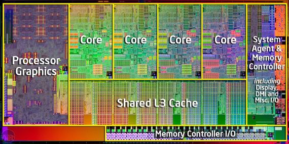

# HTTP应用的动态请求缓存方案

这次的分享主要讲讲HTTP应用的后端动态请求缓存方案。动态请求的缓存主要分为两大部分：1.基于Etag的缓存，客户端可感知的；2.服务器端的内部缓存，是客户端不可感知的。

## 1. HTTP的缓存

### 1.1 静态文件缓存

早期的HTTP协议是为静态web文件传输服务的，所设计的缓存协议也是针对静态文件的。Http协议的1.0版本有一套基于时间的静态文件缓存方案。Cache-Control与Expires用于控制浏览器缓存文件的时间间隔，在给定的缓存时间内浏览器无须访问服务器下载文件的新版本。针对时间的缓存还有Last-Modified机制，每次浏览器都访问服务器，如果文件无变更，那么服务器返回304响应，而不重新发送静态文件。

但是上面的这套缓存协议不能满足日益复杂的Web应用的需求，主要的问题有两点：

1. 随着网络规模的增长，Web服务器往往是一个集群。同一个文件在集群内不同的机器上的修改时间不一致，而且Last-Modified的时间精度只能到秒级。这导致基于Last-Modified机制的文件缓存有漏洞。

2. 更重要的是Web越来越动态化，对于一个后端提供的json API，根本就没有所谓的最后修改时间。

### 1.2 动态内容缓存Etag

这就导致了基于文件内容指纹的方案。HTTP协议在1.1版本中增加了基于Etag的指纹缓存方案。下面是一个Etag使用的例子：

	curl -g --head 'http://scm.laobai.com:9391/tpsy_evaluation_questions.json?s[tpsy_evaluation_main_id]=4&many=tpsy_evaluation_options'
	>HTTP/1.1 200 OK
	>ETag: W/"758e07c4f86f8eaf09d590ef9f23e4d6"
	>...

首次请求，服务器端返回Etag。下次客户端请求同一个url的时候，带上Etag。如果服务器端无变化，那么返回304的响应，而不是200的响应。

	curl -g --head -H 'If-None-Match: W/"758e07c4f86f8eaf09d590ef9f23e4d6"'  'http://scm.laobai.com:9391/tpsy_evaluation_questions.json?s[tpsy_evaluation_main_id]=4&many=tpsy_evaluation_options'
	>HTTP/1.1 304 Not Modified
	>ETag: W/"758e07c4f86f8eaf09d590ef9f23e4d6"
	>Cache-Control: max-age=0, private, must-revalidate

很多Web开发框架的缓存方案也经历了从时间戳到文件指纹的缓存机制升级的过程。比如Rails开发框架在2.0版本有一个基于时间戳的缓存方案，所有的js文件，url中自动带上最后修改修改时间，比如：

	xxx.js?v=1482287874
   
然后在Rails3.0框架中，这套方案更改为基于文件内容Hash的文件重命名方案，比如：

	xxx_hash.js

案例：抓包查看健保通的心理咨询模块是否利用了Etag

	ngrep -q -d eth0  -W byline 'tpsy' port 3000
	ngrep -q -d eth0  -W byline 'ETag' port 3000
	ngrep -q -d eth0  -W byline 'If-None-Match' port 3000

备注：线上接口默认应该支持https／gzip／etag，这些需要做成标配。

### 1.3 Weak Etag

上面例子里的Etag以‘W’开头，这是所谓的Weak Etag。产生Weak Etag的场景主要是内容压缩。Nginx1.7之前有一个Etag相关的Bug，而nginx开发组不认为是自己的bug。情况是这样的，当后端Web服务器提供的响应经过nginx压缩的时候，nginx会删除响应头里的etag。Nginx开发组的理由是，经过压缩后，文件内容已经变更，所以原来的etag必须删除。

从Nginx1.7.3版本开始，其gzip模块能正确的处理Weak Etag了。如果response中带Weak Etag，那么Nginx的gzip模块不处理；如果response中带strong Etag，那么Nginx的gzip模块会把它转化为Weak Etag。

Weak Etag和 (strong) ETag的区别在于：Etag保证文件的内容是完全相同的，而Weak Etag只保证文件的内容是语义上相同的。区分ETag和Weak Etag对一些byte by byte的操作有影响，比如断点续传等。

浏览器都是支持Etag的，但是前端开发框架不一定支持。如果采用前后端分离的方式开发，要自己处理Etag。

### 1.4 参考资料
*   [彻底弄懂 Http 缓存机制 - 基于缓存策略三要素分解法](https://segmentfault.com/p/1210000007850705?utm_source=weekly&utm_medium=email&utm_campaign=email_weekly)
*   [Rails / Nginx 与 Weak Etag](https://ruby-china.org/topics/23193)
*   [Web浏览器的缓存机制](http://www.alloyteam.com/2012/03/web-cache-2-browser-cache/)
*   [HTTP 缓存](https://developers.google.cn/web/fundamentals/performance/optimizing-content-efficiency/http-caching?hl=zh-cn)

## 2. 内存模型
第一章讲了基于Etag的客户端缓存，本文剩余部分则全部讲述服务器端的缓存技术。本章要讲的是从CPU到操作系统、编程语言、网络应用的内存相关知识。

### 2.1 处理器存储体系架构

单核处理器的存储系统结构：

	寄存器
	L1 / L2 / L3 缓存
	主存
	虚拟内存

多核处理器的存储系统结构：

常见处理器中存储体系最复杂的架构：PS2游戏机用到的Cell处理器

[每个程序员都应该了解的 CPU 高速缓存](https://www.oschina.net/translate/what-every-programmer-should-know-about-cpu-cache-part2?print)

### 2.2 Linux内存模型

#### OS vs Program

OS的内存空间和Program的应用内存空间隔离。

物理内存／逻辑内存

动态共享库SO／DLL

#### 进程 vs 线程

*   进程默认内存隔离，但是有共享内存机制shm。
*   线程默认内存共享，但是有线程本地存储

不同语言的并发支持：

*   nodejs/php等利用多进程实现并发
*   java通过多线程实现并发
*   ruby/python等利用多进程+多线程实现并发

子进程共享父进程内存空间、写时拷贝COW。

	
	$ ps -ef
	UID        PID  PPID  C STIME TTY          TIME CMD
	root         1     0  0 Dec14 ?        00:00:02 /sbin/init

所有linux应用程序都是从init进程派生出来的。Linux操作系统管理进程的方式是fork配合exec，如下面的代码所示：

	$irb
	>fork do
	  exec 'vim'
	end

所有的posix兼容操作系统都是类似的机制。比如在mac osx上，查看进程的派生树，可以看到进程之间父子派生关系：

	$pstree
	-+= 00001 root /sbin/launchd
	 |-+= 00287 ylt /Applications/Utilities/Terminal.app/Contents/MacOS/Terminal -psn_0_45067
	 | \-+= 04527 root login -pfl ylt /bin/bash -c exec -la bash /bin/bash
	 |   \-+= 04528 ylt -bash
	 |     \-+= 04593 ylt irb 
	 |       \--- 04624 ylt vim

当然，fork和exec也可以单独运行。下面是单独运行fork的例子，可以看到进程内存的COW机制：

	$irb
	> i=1
	  fork do
	    puts ''
		puts i
		i +=1
		puts i
		puts ''
	  end

下面是单独运行exec的例子：

	$irb
	>exec 'bash'

#### 参考资料

[进程、线程及其内存模型](http://buptjz.github.io/2014/04/23/processAndThreads)

[探索 Linux 内存模型](https://www.ibm.com/developerworks/cn/linux/l-memmod/)

#### 补充

*   变量与 内存 / 寄存器的关系
*   CPU指令集的变迁：直接内存运算越来越少，需要寄存器的操作越来越多。
*   stack vs heap

### 2.3 java内存模型

#### 为什么要有java内存模型规范 JSR 133
Since 1997, several serious flaws have been discovered in the Java Memory Model as defined in Chapter 17 of the Java Language Specification. These flaws allowed for confusing behaviors (such as final fields being observed to change their value) and undermined the compiler's ability to perform common optimizations.

The Java Memory Model was an ambitious undertaking; it was the first time that a programming language specification attempted to incorporate a memory model which could provide consistent semantics for concurrency across a variety of architectures. Unfortunately, defining a memory model which is both consistent and intuitive proved far more difficult than expected. JSR 133 defines a new memory model for the Java language which fixes the flaws of the earlier memory model. In order to do this, the semantics of final and volatile needed to change.

[The Java Language Specification, Third Edition](https://docs.oracle.com/javase/specs/jls/se6/html/j3TOC.html)
[JSR 133 (Java Memory Model) FAQ](https://www.cs.umd.edu/~pugh/java/memoryModel/jsr-133-faq.html)
[JSR 133](https://www.cs.umd.edu/~pugh/java/memoryModel/jsr133.pdf)

#### Java内存模型

The Java memory model describes how threads in the Java programming language interact through memory. 

Java的volatile保证了线程间的交互，使得当一个线程写入一个volatile变量，不仅这次写入对其他线程可见，而且其他线程可以看到该线程所有的对volatile变量的写入。

那么对于non-volatile变量又发生了什么呢？非volatile变量没有volatile关键字保证交互的好处。因此，编译器可以使用non-volatile变量的缓存值而不是volatile保证，volatile变量将总是从内存中读取。happens-before模型可以用来绑定同步访问到非volatile变量上。

[深入理解Java内存模型（一）——基础](http://www.infoq.com/cn/articles/java-memory-model-1)

#### Java虚拟机内存模型

[Jvm内存模型](http://gityuan.com/2016/01/09/java-memory/)

### 2.4 Web应用内存模型
内存／外部内存缓存memcache／数据库
hibernate的一级缓存／二级缓存

http://tracylihui.github.io/2015/07/20/Hibernate%EF%BC%9A%E7%BC%93%E5%AD%98%E6%9C%BA%E5%88%B6%E7%9A%84%E5%AD%A6%E4%B9%A0/

http://jinnianshilongnian.iteye.com/blog/1525884

画
## 3. Web对象缓存系统的设计
### 客户端可见 vs 客户端不可见
### 缓存key的设计
### 缓存key的遍历
### 缓存清除
### 缓存过期

## 4. 单个对象的缓存
### Key的设计
namespace ／ class ／ id
主动清除缓存

### Memcache缓存数据库
function find_with_cache(id)
  memcache

### 控制流抽象

template方法模式

def with_cache(hash,key)
  value = hash[key]
  return value if value
  value = yield
  hash[key]=value
  value
end

## 5. Request缓存
ThreadLocal
IdentifyMap

## 6. 列表对象的缓存
### Key的设计
namespace ／ class ／ timestamp ／ list

利用timestamp切换缓存，被动过期

## 7. 缓存请求合并

https://github.com/memcached/memcached/wiki/BinaryProtocolRevamped

getq

https://github.com/memcached/memcached/blob/master/doc/protocol.txt

gets

getq vs gets ??

## 8. 分布式锁

## 9. 缓存穿透

比如说：某个查询数据库的接口，因为调用量比较大，所以加了缓存，并设定缓存过期后刷新，问题是当并发量比较大的时候，如果没有锁机制，那么缓存过期的瞬间，大量并发请求会穿透缓存直接查询数据库，造成雪崩效应，如果有锁机制，那么就可以控制只有一个请求去更新缓存，其它的请求视情况要么等待，要么使用过期的缓存。

